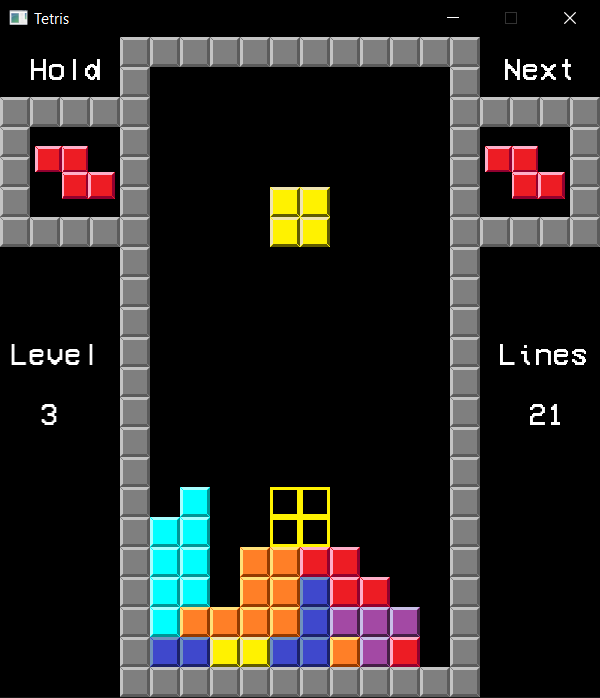

# Tetris

## About
This is my first C# project. I just wanted something fairly simple to get my feet wet. There are still plenty of things I would like to add to it including:
- Music
- Scoring
- etc

## Navigating Menus
- Up and Down arrows to change selection.
- Enter to select.

## How to Play
- Left and Right arrows move the active piece side to side.
- Holding down arrow initiates a soft drop
- Spacebar initiates a hard drop.
- F and D keys rotate the piece clockwise and counterclockwise, respectively.
- ESC pauses the game.
